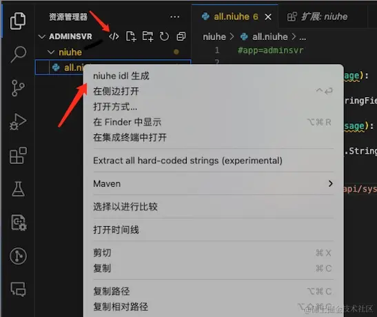
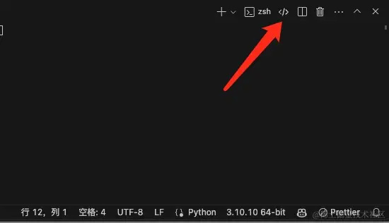
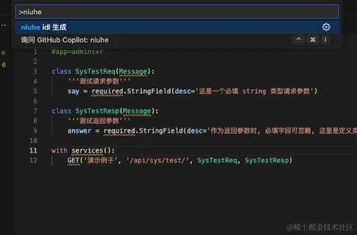

## 1. 安装与激活
1. VSCode 插件市场搜索 `niuhe`
2. 点击安装后，可通过下列四种方式激活插件生成代码
    - 方式1: 点击资源管理器顶部出现的 `</>` 图标
    - 方式2: 点击工具栏中的 `</>`图标
    - 方式3: 在资源管理器中选中任意文件并右键中 `niuhe idl 生成`
    - 方式4: `Command + Shift + P` 快捷键中 输入 `niuhe` 查找 `niuhe idl 生成`

| 方式1和3 | 方式 2 | 方式4 |
| --- | --- | --- |
|  |   |  |

